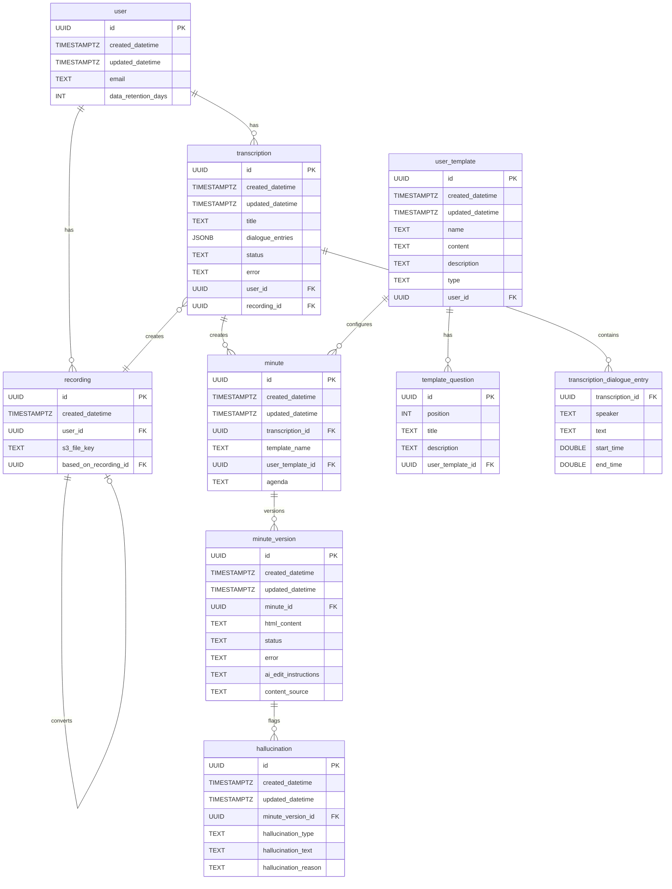
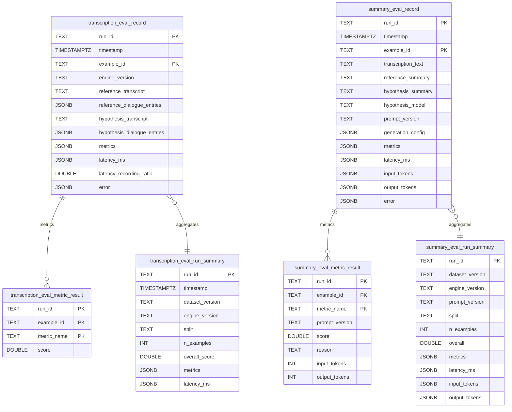

# Data Contracts

This document defines the system data contracts for processing, storage, and evaluation outputs.

All contracts are described in an SQL table-like format. Where the runtime system stores structured payloads inside `JSONB` columns, the contract includes both:

- A **logical** table view describing the expected shape of the nested payload.
- The **physical** storage table/column.

The contract tries to follow the original implementation schema and early evals implementation schema.

## Logical schema diagrams

### Input -> transcription -> summary



### Evals



---

## 1. Transcription data contract physical model (inputs + output)

Following section follows original implementation schema.

The only exception is making `transcription.recording_id FK` to `recording.id`, rather than `recording.transcription_id FK` to `transcription.id`.

### 1.1 Input: audio asset (recording)

Audio asset (recording).

```sql
CREATE TABLE recording (
  id                       UUID PRIMARY KEY,
  created_datetime          TIMESTAMPTZ NOT NULL DEFAULT now(),
  user_id                  UUID NOT NULL REFERENCES user(id),
  s3_file_key              TEXT NOT NULL,
  based_on_recording_id    UUID NULL REFERENCES recording(id) ON DELETE SET NULL
);
```

### 1.2 Input/processing context: transcription

Transcription result with diarization.

Additionally used as evals input.

```sql
CREATE TABLE transcription (
  id                   UUID PRIMARY KEY,
  created_datetime      TIMESTAMPTZ NOT NULL DEFAULT now(),
  updated_datetime      TIMESTAMPTZ NOT NULL DEFAULT now(),

  title                TEXT NULL,
  dialogue_entries     JSONB NULL,
  status               TEXT NOT NULL DEFAULT 'AWAITING_START',
  error                TEXT NULL,

  user_id              UUID NULL REFERENCES user(id),
  recording_id         UUID NOT NULL REFERENCES recording(id)
);
```

### 1.3 Output: transcription with diarization (segment-level)

`transcription.dialogue_entries` stores an array of diarized segments with the following shape.

```sql
CREATE TABLE transcription_dialogue_entry (
  transcription_id   UUID NOT NULL REFERENCES transcription(id) ON DELETE CASCADE,

  speaker            TEXT NOT NULL,
  text               TEXT NOT NULL,
  start_time         DOUBLE PRECISION NOT NULL,
  end_time           DOUBLE PRECISION NOT NULL

  PRIMARY KEY (transcription_id, speaker, start_time, end_time)
);
```

---

## 2. Summary data contract (inputs + output)

In the current schema, the summarisation/minute output is represented by `minute` + `minute_version` + `hallucination`, linked to a `transcription` and optionally to a `user_template`.

### 2.1 Inputs: summary request context

```sql
CREATE TABLE minute (
  id                 UUID PRIMARY KEY,
  created_datetime    TIMESTAMPTZ NOT NULL DEFAULT now(),
  updated_datetime    TIMESTAMPTZ NOT NULL DEFAULT now(),

  transcription_id   UUID NOT NULL REFERENCES transcription(id) ON DELETE CASCADE,

  template_name      TEXT NOT NULL DEFAULT 'General',
  user_template_id   UUID NULL REFERENCES user_template(id) ON DELETE SET NULL,

  agenda             TEXT NULL
);
```

### 2.2 Output: minute generation versions (primary summary output)

```sql
CREATE TABLE minute_version (
  id                   UUID PRIMARY KEY,
  created_datetime      TIMESTAMPTZ NOT NULL DEFAULT now(),
  updated_datetime      TIMESTAMPTZ NOT NULL DEFAULT now(),

  minute_id             UUID NOT NULL REFERENCES minute(id) ON DELETE CASCADE,

  html_content          TEXT NOT NULL DEFAULT '',

  status               TEXT NOT NULL DEFAULT 'AWAITING_START',
  error                TEXT NULL,

  ai_edit_instructions  TEXT NULL,

  content_source        TEXT NOT NULL DEFAULT 'INITIAL_GENERATION'
);
```

### 2.3 Output: hallucination annotations (quality/safety output)

```sql
CREATE TABLE hallucination (
  id                   UUID PRIMARY KEY,
  created_datetime      TIMESTAMPTZ NOT NULL DEFAULT now(),
  updated_datetime      TIMESTAMPTZ NOT NULL DEFAULT now(),

  minute_version_id     UUID NOT NULL REFERENCES minute_version(id) ON DELETE CASCADE,

  hallucination_type    TEXT NOT NULL DEFAULT 'OTHER',
  hallucination_text    TEXT NULL,
  hallucination_reason  TEXT NULL
);
```

### 2.4 Input: user template (selected structure)

```sql
CREATE TABLE user_template (
  id                 UUID PRIMARY KEY,
  created_datetime    TIMESTAMPTZ NOT NULL DEFAULT now(),
  updated_datetime    TIMESTAMPTZ NOT NULL DEFAULT now(),

  name               TEXT NOT NULL,
  content            TEXT NOT NULL,
  description        TEXT NOT NULL DEFAULT '',

  type               TEXT NOT NULL DEFAULT 'DOCUMENT',

  user_id            UUID NULL REFERENCES "user"(id)
);
```

Optional template questions (used when `user_template.type = 'FORM'`):

```sql
CREATE TABLE template_question (
  id                 UUID PRIMARY KEY,

  position           INTEGER NOT NULL,
  title              TEXT NOT NULL,
  description        TEXT NOT NULL,

  user_template_id   UUID NOT NULL REFERENCES user_template(id) ON DELETE CASCADE
);
```

---

## 3. Transcription data eval output contract

This repository contains an ADR describing transcription evaluation goals and metrics, but does not currently define a concrete eval output schema for transcription runs (unlike summarisation evals).

The following contract defines the **expected eval outputs** for transcription evaluation so results can be stored/transported consistently.

### 3.1 Detailed report: example-level transcription eval record

Per-example transcription eval results.

```sql
CREATE TABLE transcription_eval_record (
  run_id               TEXT NOT NULL,
  timestamp            TIMESTAMPTZ NOT NULL,
  example_id           TEXT NOT NULL REFERENCES transcription(id) ON DELETE CASCADE,
  engine_version        TEXT NOT NULL,

  -- Ground truth
  reference_transcript        TEXT NULL,
  reference_dialogue_entries  JSONB NULL,

  -- Hypothesis output under test
  hypothesis_transcript        TEXT NOT NULL,
  hypothesis_dialogue_entries  JSONB NULL,

  -- Metrics (normalised into transcription_eval_metric_result)
  metrics              JSONB NOT NULL,  -- map metric_name -> {"score": ..., ...}

  -- Latency and errors
  latency_ms            JSONB NOT NULL,   -- e.g., {"preprocess": 123, "transcribe": 456}
  latency_recording_ratio DOUBLE PRECISION NULL,  -- latency_ms/recording_ms
  error                 JSONB NULL,       -- e.g., {"stage": "transcribe", "message": "..."}

  PRIMARY KEY (run_id, example_id)
);
```

### 3.2 Optional normalization: metric results

Metric results (metric_name as a row).

```sql
CREATE TABLE transcription_eval_metric_result (
  run_id               TEXT NOT NULL,
  example_id           TEXT NOT NULL,

  metric_name          TEXT NOT NULL,  -- e.g., wer, speaker_attributed_wer, word_diarisation_error_rate, speaker_confusion_rate
  score                DOUBLE PRECISION NOT NULL

  PRIMARY KEY (run_id, example_id, metric_name),
  FOREIGN KEY (run_id, example_id) REFERENCES transcription_eval_record(run_id, example_id) ON DELETE CASCADE
);
```

### 3.3 Summary output: run-level transcription eval summary

Run-level transcription eval results. Summarises transcription_eval_record for the run_id.

```sql
CREATE TABLE transcription_eval_run_summary (
  run_id               TEXT PRIMARY KEY,
  timestamp            TIMESTAMPTZ NOT NULL,

  dataset_version      TEXT NOT NULL,
  engine_version        TEXT NOT NULL,

  split                TEXT NULL,
  n_examples           INTEGER NOT NULL,

  overall_score        DOUBLE PRECISION NULL,

  metrics              JSONB NOT NULL,    -- e.g., {"wer": {"mean": 0.12, "min": 0.10, "max": 0.20, "std": 0.05}, ...}
  latency_ms           JSONB NOT NULL     -- e.g., {"transcribe_p50": 4500, ...}
);
```

---

## 4. Summary data eval output contract

### 4.1 Detailed report: example-level eval record

Per-example summary eval results.

```sql
CREATE TABLE summary_eval_record (
  run_id               TEXT NOT NULL,
  timestamp            TIMESTAMPTZ NOT NULL,

  example_id           TEXT NOT NULL,
  transcription_text   TEXT NOT NULL,
  reference_summary    TEXT NULL,

  hypothesis_summary    TEXT NOT NULL,
  hypothesis_model      TEXT NOT NULL,
  prompt_version       TEXT NOT NULL,
  generation_config    JSONB NOT NULL,  -- {"temperature": ..., "max_tokens": ...}

  metrics              JSONB NOT NULL,  -- map metric_name -> {"score": 0..1, "reason": "..."}
  latency_ms           JSONB NOT NULL,  -- e.g., {"summarize": 1234, "judge": 567}
  input_tokens         INTEGER NOT NULL,
  output_tokens        INTEGER NOT NULL,

  error                JSONB NULL,

  PRIMARY KEY (run_id, example_id)
);
```

### 4.2 Optional normalization: metric results (metric_name as a row)

Metric results (metric_name as a row).

```sql
CREATE TABLE summary_eval_metric_result (
  run_id               TEXT NOT NULL,
  example_id           TEXT NOT NULL,

  metric_name          TEXT NOT NULL,
  prompt_version       TEXT NULL,  -- some metrics may not use LLMs
  score                DOUBLE PRECISION NOT NULL,
  reason               TEXT NULL,  -- some metrics may not use LLMs
  input_tokens         INTEGER NULL,  -- some metrics may not use LLMs
  output_tokens        INTEGER NULL,  -- some metrics may not use LLMs

  PRIMARY KEY (run_id, example_id, metric_name),
  FOREIGN KEY (run_id, example_id) REFERENCES summary_eval_record(run_id, example_id) ON DELETE CASCADE
);
```

### 4.3 Summary output: run-level summary

Run-level summarisation eval results. Summarises summary_eval_record for the run_id.

```sql
CREATE TABLE summary_eval_run_summary (
  run_id               TEXT PRIMARY KEY,

  dataset_version      TEXT NOT NULL,
  engine_version        TEXT NOT NULL,
  prompt_version       TEXT NOT NULL,

  split                TEXT NOT NULL,
  n_examples           INTEGER NOT NULL,

  overall              DOUBLE PRECISION NULL,

  metrics              JSONB NOT NULL,  -- {metric_name: {"mean": number, "sd": number}}
  latency_ms           JSONB NOT NULL,  -- {"summarize": int, "judge": int}
  input_tokens         INTEGER NOT NULL,
  output_tokens        INTEGER NOT NULL
);
```
