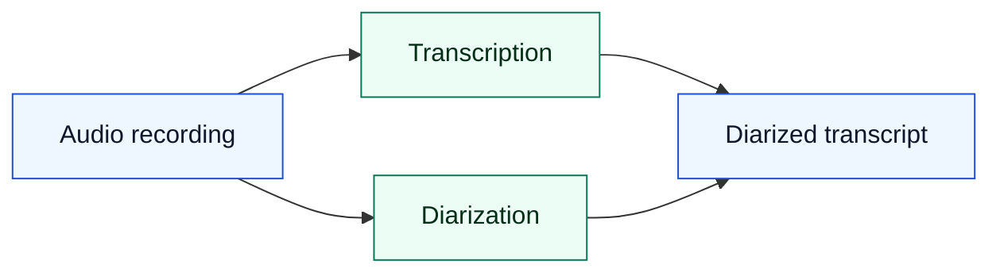
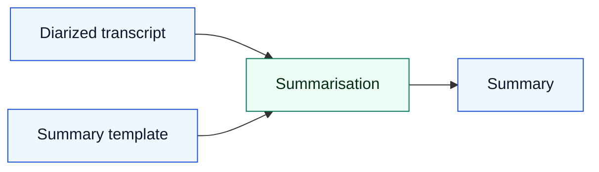
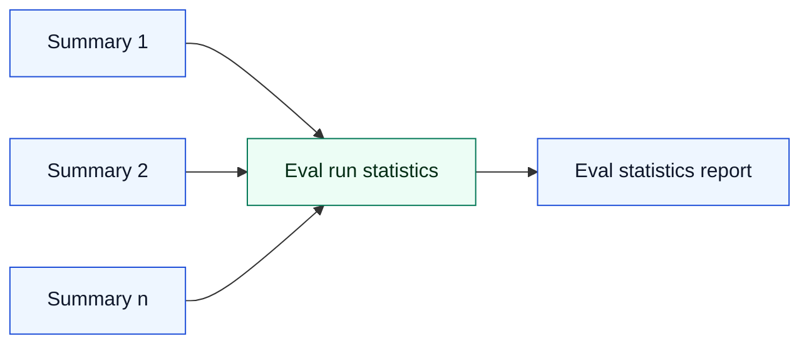

# Evals flow

## Steps:

### 1. Transcription and Diarization

### 2. Summarization

### 3. Statistics reporting

## Data involved

- Audio recordings with multiple speakers
- Diarized Transcriptions
- Summary Templates
- Summaries
- Output: eval statistics report

### Eval datasets

- Aiming for ~100 eval examples (data points), otherwise as many as possible
- Data points should cover a wide range of features (speaker count, scenarios, noise level, accents, etc.)

- Ideally: Each eval data point contains:
  - an audio recording with multiple speakers
  - a diarized transcription produced by a human
  - a summary template
  - a gold summary (produced by a human)
- At minimum:
  - an audio recording with multiple speakers
  - a diarized transcription created by an AI
  - a summary template
  - an approved summary generated by an AI

### Metrics

- Transcription: Word Error Rate (WER), Jaccard Error Rate (JER)
- Diarization: Diarization Error Rate (WDER)
- Summarization: LLM-as-judge on multiple criteria (faithfulness, coherence, _bias_, etc.)

#### Bias

We are planning on creating a bias dataset, where we are interested in using real transcripts and systematically modifying protected characteristics (e.g. names, gender) to assess how summary accuracy and faithfulness change.

### Storage and processing

Eval datasets and results are stored in an S3 bucket within MHCLG AWS account.

Processing happens in a secure environment within the same AWS account.

We propose to access restrict the access to the dataset data to engineers and analysts working on improving the system.

The statistical results of the evals that do not contain any sensitive information should be able to be made publicly available.
