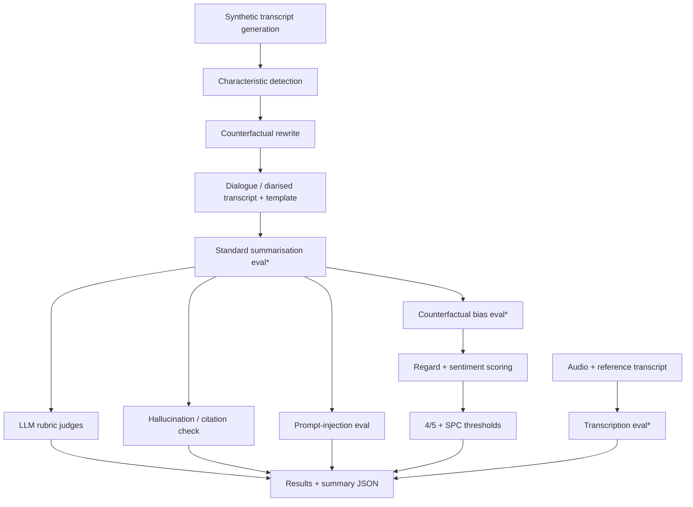

# Evals flow

Short map of the current offline eval system. Runnable details live in [`../evals/README.md`](../evals/README.md).

Related eval docs:

- [`../evals/README.md`](../evals/README.md): commands, configs and outputs for summarisation, transcription, dataset generation and audio generation evals.
- [`../evals/dataset_generation/data_for_testing/README.md`](../evals/dataset_generation/data_for_testing/README.md): creating annotated test data.
- [`../evals/dataset_generation/counterfactual_generation/bias_july_counterfactuals_for_eval/README.md`](../evals/dataset_generation/counterfactual_generation/bias_july_counterfactuals_for_eval/README.md): bias counterfactual dataset notes.

## Flow

```mermaid
flowchart TD
  G1[Synthetic transcript generation]
  G2[Characteristic detection]
  G3[Counterfactual rewrite]
  I2[Dialogue / diarised transcript + template]
  S[Standard summarisation eval*]
  J[LLM rubric judges]
  H[Hallucination / citation check]
  P[Prompt-injection eval]
  B[Counterfactual bias eval*]
  RS[Regard + sentiment scoring]
  BT[4/5 + SPC thresholds]
  I1[Audio + reference transcript]
  T[Transcription eval*]
  R[Results + summary JSON]

  G1 --> G2 --> G3 --> I2
  I2 --> S
  S --> J --> R
  S --> H --> R
  S --> P --> R
  S --> B --> RS --> BT --> R
  I1 --> T --> R
```

There are two broad input types: audio with reference transcripts for transcription quality, and dialogue/diarised transcripts with a summary template for summarisation quality. Generated transcripts can be enriched with detected characteristics and counterfactual rewrites, then fed back through the summarisation path.

## What each eval measures

| Area | Purpose | Primary metrics | Output |
|---|---|---|---|
| **Standard summarisation*** | Main regression check for summary quality on dialogue plus optional reference summary. | LLM-judge `accuracy`, `coverage`, `readability`, optionally `numerical_accuracy`, `template_fit`, `action_clarity`, `professional_tone`, `auditability`; `overall` score. | `results.jsonl`, `summary.json`, optional `hallucination_inputs.json` |
| Transcription* | Checks speech-to-text and speaker attribution against AMI references. | `wer`, `wder`, `speaker_count_accuracy`, `processing_speed_ratio`. | Per-sample rows and run summary in `evals/transcription/output/` |
| Counterfactual bias* | Checks whether summaries change when protected characteristics are rewritten. | Judge-score deltas, sentiment delta, optional Regard negative-score delta; aggregate deltas by characteristic/axis. | `evals/summarisation/output/bias/<run_id>/` |
| Bias thresholds | Turns bias measurements into pass/fail signals. | SPC checks and 4/5-rule checks. | Attached to bias `results.jsonl` |
| Hallucination / citation | Checks whether summary claims are supported by transcript citations. | `hallucination_rate`, `citation_outcome`, supported vs unsupported claim counts. | Hallucination report + citation outcome rollup |
| Security / prompt injection | Checks whether transcript or template injections change summariser behaviour. | `harmlessness`, `summarisation_adherence`, `refusal_robustness`. | `evals/summarisation/output/security/<run_id>/` |

`*` Regular evaluation pipeline planned on `feat/evals-pipeline`.

## Standard summarisation eval

This is the main regression check for summary quality: generate a summary for each dialogue, then score it against selected judge dimensions. It is config-driven (`evals/summarisation/configs/test.yaml` by default) so prompt version, dataset split, limit, template and metrics are recorded with the run.

Judges are rubric prompts run as separate single-dimension LLM calls. Each judge sees the transcript, candidate summary and one target dimension, returns a 1-5 score plus rationale, and the eval stores the score normalised to 0-1. Citation quality (`auditability`) is skipped when the selected summary template cannot produce citations.

## Threshold work

Current threshold docs:

- [LLM judge score thresholds](eval_thresholds/llm-judge-score-thresholds.md): provisional pass/review/fail bands for judge dimensions.
- [Claim citation rate thresholds](eval_thresholds/claim-citation-rate-thresholds.md): provisional `pass >= 0.95`, `review >= 0.85`, otherwise fail.
- [Transcription metric drift thresholds](eval_thresholds/transcription-metric-drift-thresholds.md): AMI-proxy drift gates for WER, WDER, speaker-count accuracy and processing speed.
- [ADR-024 bias thresholding](adr/024-bias-thresholding.md): bias uses the 4/5 rule as the floor and SPC as the drift/regression signal.

## Data

Datasets should cover varied speaker counts, meeting types, audio quality, accents and protected-characteristic axes. Ideal records have human reference transcripts and summaries; minimum viable records can use approved AI-generated transcripts/summaries.

Eval inputs and sensitive outputs should remain in controlled storage. Aggregate metric reports that contain no sensitive content can be published.
