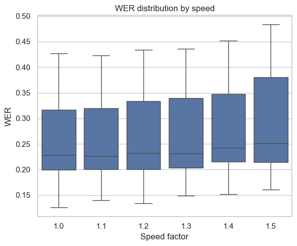
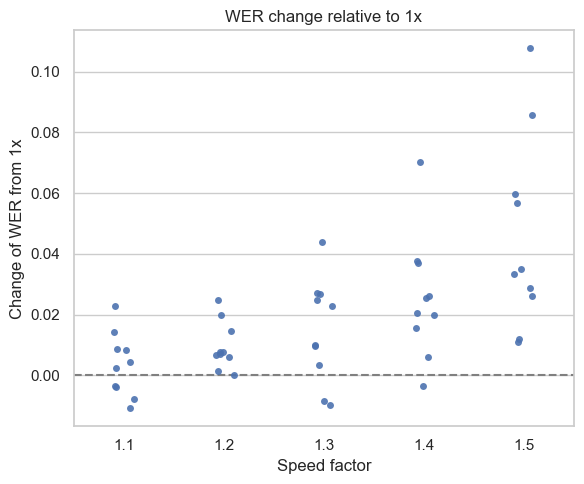
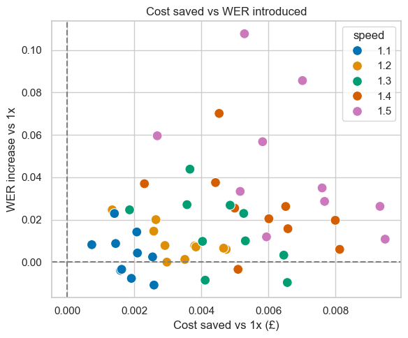
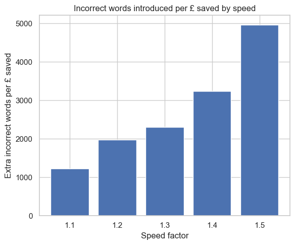

# Explore Speeding Audio

[Ticket 180](https://mhclgdigital.atlassian.net/browse/AIILG-180)

Explore how transcribing a sped up audio file impacts transcription quality (WER) and transcription cost.

## Considered Options

Speeding up audio from 1.0x speed to rates 1.1x, 1.2x, 1.3x, 1.4x, and 1.5x.

## Method

- Using 10 samples from the AMI dataset, 1-10 minutes each.
- Speed audio files using FFmpeg, optimising for:
  - Transcription quality (Word Error Rate)
  - Transcription cost (using Azure pricing)
- Compare these metrics against 1.0x speed.

## Outputs

WER increases linearly with sped audio:

Relative to 1.0x:

This does come at the benefit of cost savings, with higher speeds resulting in higher cost saved:

### (Proposed) Decision Outcome

How do we want to balance cost savings vs WER. One way we could look at it is how much 'incorrectness' is introduced by increasing audio speed:

If we want no more error, we should stay at 1.0x speed. However, 1.1x and 1.2x only introduce 1%/2% WER and would cut transcription costs dows by 10%/20%, so should be considered. Higher speeds do have higher WER, so this entirely depends on our willingess to trade WER for cost.

## Caveats/Questions

- Some instances of sped audio reduce WER, unintuitive outcome.
- Only WER used for transcription quality - no metrics on diarisation or semantic quality.
  - WER score doesn't replace human assessment of transcription quality
- What speed do MoJ use (if used)?
